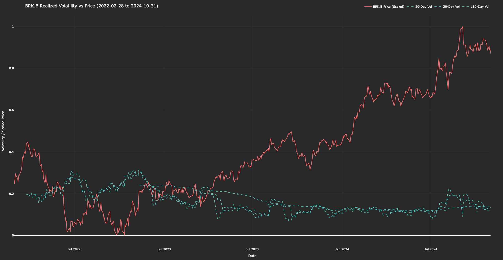

# brkb_realized_volatility_calculator

- This project calculates and visualizes the realized volatility of **$BRKB** (Berkshire Hathaway) using daily price data.
- It computes realized volatility over multiple time windows and overlays it with scaled stock prices.

---

## Files
- `brkb_realized_vol_calc.py`: Main script for calculating and plotting realized volatility.
- `brkb.csv`: Dataset containing historical stock prices of $BRKB.
- `output.png`: Plot
---

## Libraries Used
- `numpy`
- `pandas`
- `plotly`

---

## Timeframe
- **Input**: Data ranges from **2022-02-28** to **2024-10-31** (from `brkb.csv`).
- **Output**: Displays 20-day, 30-day, and 180-day realized volatility alongside scaled prices.

## Screenshots

